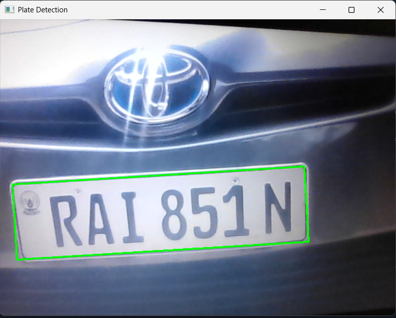
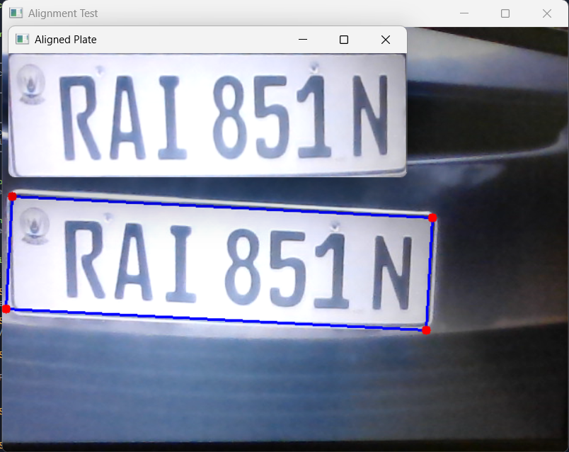
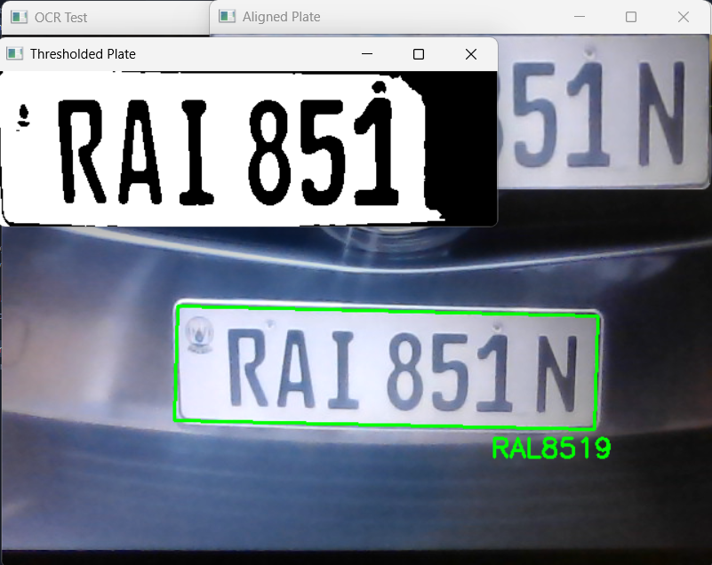

# ANPR Project - Automatic Number Plate Recognition

<div align="center">
A Three-Step Pipeline for Car Number Plate Extraction
Detection · Alignment · OCR
</div>

## 📋 Table of Contents

- [Overview](#-overview)
- [Pipeline Architecture](#️-pipeline-architecture)
- [Features](#-features)
- [Project Structure](#-project-structure)
- [Installation](#️-installation)
- [Usage Guide](#-usage-guide)
- [Code Modules](#-code-modules)
- [Configuration](#-configuration)
- [Results](#-results)
- [Troubleshooting](#-troubleshooting)
- [Limitations & Future Work](#-limitations--future-work)
- [Acknowledgments](#acknowledgments)

## 🔍 Overview

This project implements a transparent, CPU-friendly Automatic Number Plate Recognition (ANPR) system using classical computer vision techniques. Unlike black-box deep learning approaches, this pipeline is designed to be understandable, teachable, and easily debuggable—making it ideal for educational purposes and controlled environments like parking entrances or security gates.

The system processes live video feed through three sequential stages: detecting the plate region, correcting its geometry, and extracting the text using OCR—all while running on ordinary laptops without GPU acceleration.

## 🏗️ Pipeline Architecture

```
┌────────────┐    ┌────────────┐    ┌────────────┐    ┌────────────┐    ┌────────────┐
│   Camera   │ -> │  Detection │ -> │ Alignment  │ -> │    OCR     │ -> │ Validation │
│    Feed    │    │            │    │            │    │            │    │            │
└────────────┘    └────────────┘    └────────────┘    └────────────┘    └──────┬─────┘
                                                                                │
                                                                                ▼
┌────────────┐    ┌────────────┐    ┌────────────┐                     ┌────────────┐
│ CSV Logging │ <- │  Temporal  │ <- │   Regex    │                     │            │
│             │    │ Confirmation│    │ Validation │                     │            │
└────────────┘    └────────────┘    └────────────┘                     └────────────┘
```

### Step 1: Plate Detection
The system identifies potential plate regions using contour analysis and geometric filtering—looking for rectangles with specific aspect ratios (typically 2:1 to 8:1) and sufficient area.

### Step 2: Plate Alignment
Detected plates undergo perspective correction to transform them into normalized 450×140 pixel images. This critical step corrects rotation, slant, and perspective distortion, ensuring optimal OCR performance.

### Step 3: OCR & Validation
Tesseract OCR extracts text from the aligned image. The output is validated against country-specific regex patterns and confirmed across multiple frames before logging to CSV.

## ✨ Features

| Feature | Description |
|---------|-------------|
| CPU-Optimized | Runs on ordinary laptops without GPU |
| Modular Design | Each pipeline stage can be tested independently |
| Geometric Detection | No deep learning required for basic operation |
| Perspective Correction | Automatic deskewing and rectification |
| Regex Validation | Ensures extracted text matches plate format |
| Temporal Confirmation | Requires consistent readings across multiple frames |
| Duplicate Suppression | 10-second cooldown between saves |
| CSV Logging | All validated plates saved with timestamps |
| Educational Focus | Transparent, debuggable, and teachable code |

## 📁 Project Structure

```
anpr-project/
│
├── README.md                 # Project documentation
├── requirements.txt          # Python dependencies
├── .gitignore                # Git ignore file
│
├── src/                       # Source code modules
│   ├── camera.py             # Camera validation test
│   ├── detect.py             # Plate detection module
│   ├── align.py              # Plate alignment and warping
│   ├── ocr.py                # OCR text extraction
│   ├── validate.py           # Regex validation
│   └── main.py               # Full pipeline with logging
│
├── data/                      # Output directory
│   └── plates.csv            # Logged plate numbers with timestamps
│
└── screenshots/               # Visual documentation
    ├── detection.png         # Detection stage screenshot
    ├── alignment.png         # Alignment stage screenshot
    └── ocr.png               # OCR stage screenshot
```

## ⚙️ Installation

### Prerequisites
- Python 3.7+
- Tesseract OCR engine (system-level installation required)
- Webcam (for live capture)

### Step 1: Install Tesseract OCR

<details>
<summary><b>macOS (Homebrew)</b></summary>

```bash
brew install tesseract
```
</details>

<details>
<summary><b>Ubuntu/Debian</b></summary>

```bash
sudo apt update
sudo apt install tesseract-ocr
```
</details>

<details>
<summary><b>Windows</b></summary>

Download and install from [UB-Mannheim/tesseract](https://github.com/UB-Mannheim/tesseract/wiki)

Add Tesseract to system PATH during installation.
</details>

**Verify Installation:**

```bash
tesseract --version
```

### Step 2: Set up Python Environment

```bash
# Clone the repository
git clone https://github.com/yourusername/anpr-project.git
cd anpr-project

# Create virtual environment (recommended)
python3 -m venv .venv

# Activate virtual environment
# On macOS/Linux:
source .venv/bin/activate
# On Windows:
# .venv\Scripts\activate

# Upgrade pip and install dependencies
python -m pip install --upgrade pip setuptools wheel
pip install -r requirements.txt
```

**requirements.txt**
```
opencv-python==4.8.1.78
numpy==1.24.3
pytesseract==0.3.10
pandas==2.0.3
```

## 🚀 Usage Guide

The project is designed for incremental learning—run each script in order to understand the pipeline step by step.

1. **Camera Validation**
   ```bash
   python src/camera.py
   ```
   Verifies webcam functionality. Press `q` to exit.

2. **Plate Detection**
   ```bash
   python src/detect.py
   ```
   Displays detected plate candidates with bounding boxes.

3. **Plate Alignment**
   ```bash
   python src/align.py
   ```
   Shows both detection and perspective-corrected plate.

4. **OCR Extraction**
   ```bash
   python src/ocr.py
   ```
   Extracts and displays text from aligned plates.

5. **Regex Validation**
   ```bash
   python src/validate.py
   ```
   Validates OCR output against Rwanda plate format.

6. **Complete Pipeline**
   ```bash
   python src/main.py
   ```
   Full system with temporal confirmation and CSV logging. Press `q` to quit.

## 📚 Code Modules

### camera.py
Simple camera test to verify webcam connectivity and permissions.

### detect.py
**Core Function:** `find_plate_candidates(frame)`

- Converts frame to grayscale
- Applies Gaussian blur and Canny edge detection
- Finds contours and filters by area and aspect ratio
- Returns list of candidate plate regions

### align.py
**Core Functions:**

- `order_points(pts)`: Orders four corners consistently
- `warp_plate(frame, rect)`: Applies perspective transform

**Output dimensions:** 450×140 pixels

### ocr.py
**Core Function:** `read_plate_text(plate_img)`

- Preprocesses image (grayscale, blur, threshold)
- Configures Tesseract with character whitelist
- Returns extracted text

### validate.py
**Core Function:** `extract_valid_plate(text)`

- Applies regex pattern: `[A-Z]{3}[0-9]{3}[A-Z]`
- Returns validated plate or `None`

### main.py
**Complete Pipeline Features:**

- Circular buffer for temporal confirmation (5 frames)
- Majority voting for plate confirmation
- Duplicate suppression (10-second cooldown)
- CSV logging with timestamps

## ⚡ Configuration

Key parameters you can adjust in the scripts:

| Parameter | File | Description | Default |
|-----------|------|-------------|---------|
| MIN_AREA | detect.py | Minimum contour area | 600 |
| AR_MIN | detect.py | Minimum aspect ratio | 2.0 |
| AR_MAX | detect.py | Maximum aspect ratio | 8.0 |
| W_OUT | align.py | Output width after warp | 450 |
| H_OUT | align.py | Output height after warp | 140 |
| BUFFER_SIZE | main.py | Frames for temporal confirmation | 5 |
| COOLDOWN | main.py | Seconds between saves | 10 |
| PLATE_RE | validate.py | Regex pattern | `r'[A-Z]{3}[0-9]{3}[A-Z]'` |

## 📊 Results

### Screenshots

<div align="center">

| Detection | Alignment | OCR |
|-----------|-----------|-----|
| <br>Plate region detected | <br>Perspective corrected | <br>Text extracted |

</div>

### Sample CSV Output

The system logs validated plates to `data/plates.csv`:

```csv
Plate Number,Timestamp
RAB123A,2025-03-15 14:23:45
RAC456B,2025-03-15 14:24:12
RAD789C,2025-03-15 14:25:03
```

## 🔧 Troubleshooting

| Issue | Likely Cause | Solution |
|-------|--------------|----------|
| Camera not opening | Wrong index or permissions | Try `cv2.VideoCapture(1)` or check camera permissions |
| TesseractNotFoundError | Tesseract not in PATH | Install Tesseract or set path manually:<br>`pytesseract.pytesseract.tesseract_cmd = r'C:\Program Files\Tesseract-OCR\tesseract.exe'` |
| NumPy compatibility error | Conflicting package versions | Use virtual environment and install exact versions: `pip install numpy==1.24.3` |
| No plates detected | Poor lighting or angle | Ensure plate is clearly visible and well-lit |
| OCR returns garbage | Poor alignment or preprocessing | Check alignment quality and thresholding |

## 🎯 Limitations & Future Work

### Current Limitations
- **Geometric Assumption:** Assumes plates appear approximately rectangular
- **Controlled Environment:** Best results with consistent camera angles
- **Single Format:** Currently configured for Rwanda plate format
- **Lighting Sensitivity:** Performance degrades in poor lighting

### Planned Enhancements
- Add YOLO-based deep learning detector for challenging conditions
- Support multiple plate formats via configuration file
- Implement GUI for easy parameter tuning
- Add video file processing capability
- Create REST API for integration
- Support for night vision and IR cameras

<div align="center">
⭐ Found this project helpful? Give it a star! ⭐

Built with transparency and education in mind
</div>